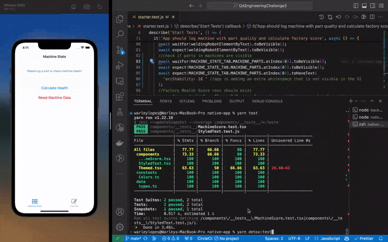

# Mobile Test Automation for React Native Project

This repository showcases mobile test automation for a React Native project using the Detox framework. It also includes unit tests for components in the mobile app, as well as unit tests and test automation for the API.

## Detox Demonstration

## Table of Contents

- [Mobile Test Automation - Detox](./native-app/e2e/starter.test.js)
- [Unit Tests for Components - Jest](./native-app/components/__tests__/MachineScore.test.tsx)
- [Unit Tests for the API - Jest](./backend/__tests__/calculate.test.ts)
- [API Test Automation - Axios Request](./backend/__tests__/api.test.ts)
- [Detox Artifacts](./native-app/artifacts/)
- [Jest Test Coverage from Unit Tests - Mobile App](./native-app/coverage/lcov-report/index.html)
- [Jest Test Coverage from Unit Tests - API](./backend/coverage/lcov-report/index.html)
- [Mobile Components/UI Snapshots](./native-app/components/__tests__/__snapshots__/)
- [Coding Test Challenge](https://github.com/BellSantCodingChallenge/QAEngineeringChallenge2?tab=readme-ov-file#bellsant-qa-engineer-coding-challenge)

## Introduction

In this repository, you will find a comprehensive set of tests for a React Native project. The tests cover both the mobile app and the API, ensuring the quality and reliability of the software.

## Mobile Test Automation

The mobile test automation is implemented using the Detox framework. Detox provides a powerful and efficient way to write end-to-end tests in either JavaScript or TypeScript for React Native applications in order to run tests for both iOS and Android with the same code. The tests simulate user interactions and verify the expected behavior of the app.

To run the mobile test automation, follow these steps:

Make sure you have [nvm](https://github.com/nvm-sh/nvm?tab=readme-ov-file#installing-and-updating) installed.
And have node version >= 18 installed and being used through nvm.

1. Clone the repository: `git clone https://github.com/WarleyLopes/QAEngineeringChallenge2`
2. In a new terminal window, navigate to `./backend/`
3. Install the dependencies for the API with `yarn install`
4. Start the API server with: `yarn start`
5. In a new terminal window, navigate to `./native-app/`
6. Install dependencies: `yarn install`
7. Run the build with: `yarn detox:build`
8. Run the tests with: `yarn detox:test`

Artifacts for the run will be generated in case of any failing tests inside the [artifacts](./native-app/artifacts/) folder.

## Mobile Components Unit Testing

These tests ensure that individual components of the app function correctly and meet the expected behavior. The unit tests are run using the Jest framework, which provides a simple and efficient way to write and run tests in JavaScript or TypeScript and automatically generate code coverage.

To run the unit tests for the mobile components, follow these steps:

Make sure you have [nvm](https://github.com/nvm-sh/nvm?tab=readme-ov-file#installing-and-updating) installed.
And have node version >= 18 installed and being used through nvm.

1. Clone the repository: `git clone https://github.com/WarleyLopes/QAEngineeringChallenge2`
2. Navigate to `./native-app/`
3. Install dependencies: `yarn install`
4. Run the tests with: `yarn test`

## Tests for the API

In this section, you will find unit tests for the API and Test Automation using actual requests. These tests ensure that the API functions correctly and returns the expected results. The unit tests and the requests are also run using the Jest framework.

To run the tests for the API, follow these steps:

Make sure you have [nvm](https://github.com/nvm-sh/nvm?tab=readme-ov-file#installing-and-updating) installed.
And have node version >= 18 installed and being used through nvm.

1. Clone the repository: `git clone https://github.com/WarleyLopes/QAEngineeringChallenge2`
2. Navigate to `./backend/`
3. Install dependencies: `yarn install`
4. Run the server with: `yarn start`
5. In a separated termina, run the tests with: `yarn test`

## Pre-commit hooks

For both `./backend/` and `./native-app/` I also took the extra step of adding a pre-commit hook to run [prettier](https://prettier.io/), [eslint](https://eslint.org/), and [jest](https://jestjs.io/) automatically on before being able to complete a commit. This allows an automatic forced run of those in order to makee sure the coode is formatted according to the defined rules of the project, eslint will enforce code quality and style guidelines according to configurations too, and jest will run the unit tests. This ensures that the codebase remains consistent, maintainable, and free of common errors as long as the tests are comprehensive and extent enough.
